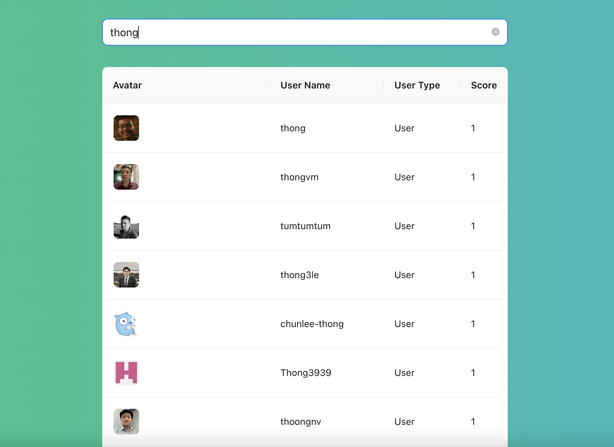

# React + TypeScript + Vite + Redux


This project is only for Skedulo take home exercise

Instruction to start react app:
```
npm install
npm run dev
```

The solution for the second question got implement in folder: ```src/exercise2``
To run test:

```
npm test
```

app img:
